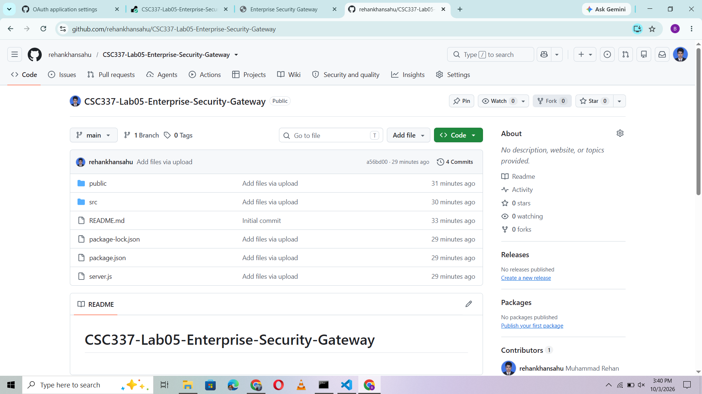
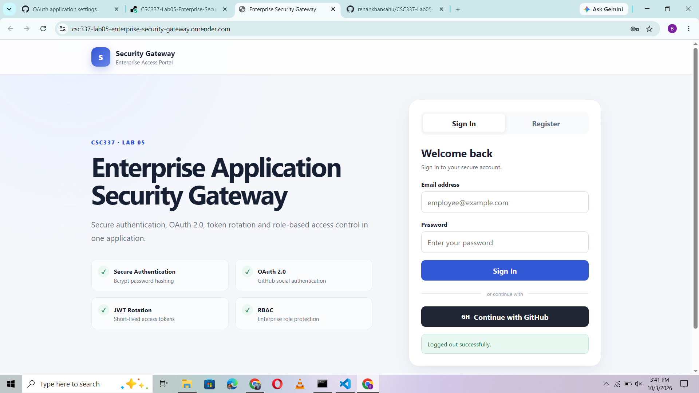
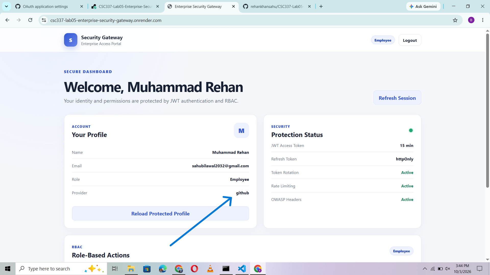
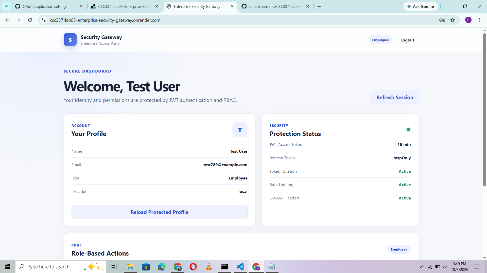
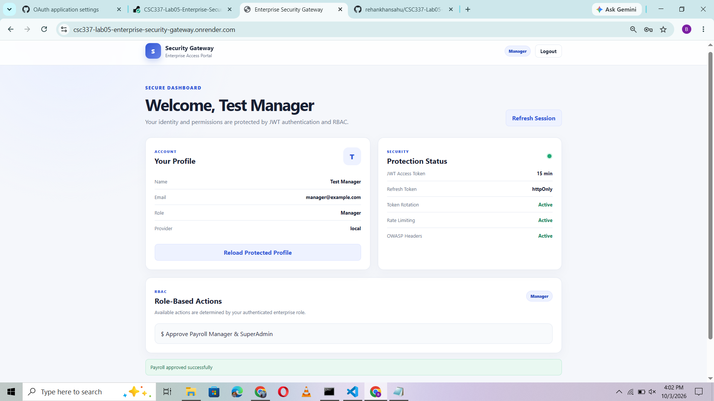
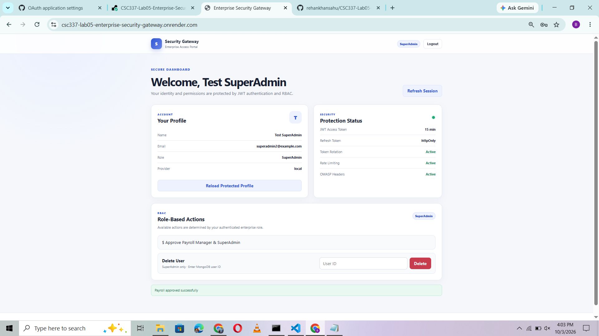
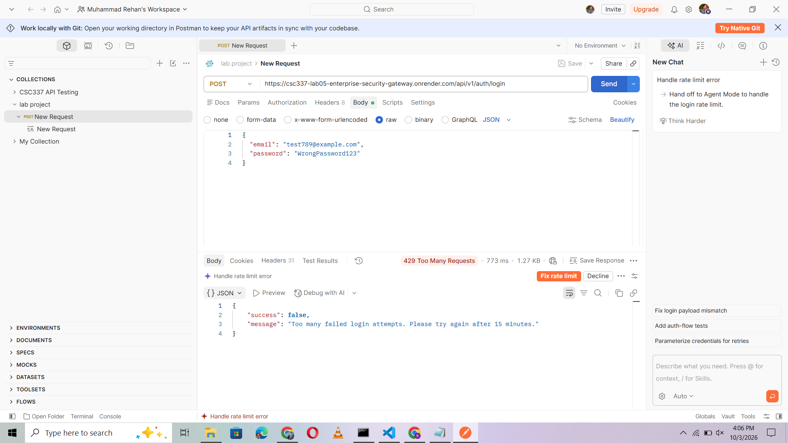

# CSC337 Lab Assignment 05

# Enterprise Multi-Tenant Security Gateway

A production-oriented full-stack security application developed for **CSC337 — Advanced Web Technologies, Lab Assignment 05**.

The project demonstrates **Hybrid Authentication, JWT Access & Refresh Token Rotation, GitHub OAuth 2.0, Role-Based Access Control (RBAC), Rate Limiting, and OWASP Security Hardening** using Node.js, Express.js, MongoDB Atlas, and Passport.js.

---

## 🌐 Live Project

### Live Application

https://csc337-lab05-enterprise-security-gateway.onrender.com

### Live Backend / API Base URL

https://csc337-lab05-enterprise-security-gateway.onrender.com/api/v1

### API Health Check

https://csc337-lab05-enterprise-security-gateway.onrender.com/api/v1/health

### Public GitHub Repository

https://github.com/rehankhansahu/enterprise-security-gateway

---

## 📌 Project Overview

The **Enterprise Multi-Tenant Security Gateway** is a secure full-stack application designed to demonstrate modern enterprise authentication and authorization practices.

The application supports both local and social authentication while implementing secure token management, server-side role authorization, brute-force protection, and OWASP security controls.

The system provides:

* Local registration and login
* Bcrypt password hashing
* GitHub OAuth 2.0 authentication
* JWT Access Tokens
* Refresh Token Rotation
* httpOnly refresh-token cookies
* Token revocation on logout
* Role-Based Access Control
* Employee, Manager, and SuperAdmin roles
* Login rate limiting
* Helmet security headers
* Strict CORS policy
* NoSQL injection protection
* XSS input sanitization
* MongoDB Atlas persistence
* Responsive security dashboard
* Production HTTPS deployment on Render

---

# 📸 Application Screenshots

## 1. Public GitHub Repository

The complete project source code is available through a public GitHub repository.



---

## 2. Live Application on Render

The full application is deployed on Render with an active HTTPS connection.



---

## 3. GitHub OAuth 2.0 Authentication

The application supports social authentication through GitHub OAuth 2.0 using Passport.js.



---

## 4. Employee Security Dashboard

The Employee dashboard provides protected profile access while restricting privileged actions.



---

## 5. Manager RBAC — Payroll Approval

The Manager role can access the protected payroll approval endpoint.



---

## 6. SuperAdmin RBAC Dashboard

The SuperAdmin role has access to payroll approval and user-management functionality.



---

## 7. Login Rate Limiting — HTTP 429

After the configured number of failed login attempts, the authentication endpoint rejects additional attempts with:

```text
429 Too Many Requests
```



---

# 🔐 1. Local Authentication & Password Hashing

The application implements secure local authentication.

### Register

```http
POST /api/v1/auth/register
```

### Login

```http
POST /api/v1/auth/login
```

Passwords are salted and hashed using **Bcrypt** before being stored in MongoDB.

A stored password has a format similar to:

```text
$2b$12$.....................................................
```

Plain-text passwords are never stored in the database.

### Secure Public Registration

Public users cannot assign themselves privileged roles.

Every public registration is automatically assigned:

```text
Employee
```

This prevents privilege escalation through manipulated registration requests.

---

# 🐙 2. GitHub OAuth 2.0

The project implements social authentication through **GitHub OAuth 2.0** using Passport.js.

### Start OAuth

```http
GET /api/v1/auth/github
```

### OAuth Callback

```http
GET /api/v1/auth/github/callback
```

### Authentication Flow

```text
User
 │
 ▼
Enterprise Security Gateway
 │
 ▼
GitHub OAuth
 │
 ▼
GitHub Authorization
 │
 ▼
OAuth Callback
 │
 ▼
Passport.js
 │
 ▼
MongoDB Profile Synchronization
 │
 ▼
Refresh Token Cookie
 │
 ▼
Secure Dashboard
```

On successful authentication:

* GitHub profile information is synchronized with MongoDB
* The OAuth account receives the `Employee` role
* A refresh token is generated
* The refresh token is stored inside an httpOnly cookie
* The frontend obtains a short-lived access token through the secure refresh flow

OAuth users do not require a local password.

---

# 🎟️ 3. Access Token Architecture

Authenticated API requests use JWT Access Tokens.

### Lifetime

```text
15 Minutes
```

Protected routes require:

```http
Authorization: Bearer <ACCESS_TOKEN>
```

The access token contains the authenticated user's:

```text
User ID
Email
Role
```

The frontend keeps the access token in application memory rather than permanently storing it in browser localStorage.

---

# 🍪 4. Refresh Token Rotation

The application implements long-lived refresh tokens.

### Lifetime

```text
7 Days
```

### Endpoint

```http
POST /api/v1/auth/refresh
```

Refresh tokens are stored inside secure cookies.

### Cookie Configuration

```text
HttpOnly = true
SameSite = Strict
Secure = true in production
```

The production application is served over HTTPS, allowing the `Secure` cookie flag to be enabled.

### Rotation Flow

```text
Old Refresh Token
        │
        ▼
JWT Verification
        │
        ▼
MongoDB Token Validation
        │
        ▼
Generate New Access Token
        │
        ▼
Generate New Refresh Token
        │
        ▼
Replace Stored Refresh Token
        │
        ▼
Set New httpOnly Cookie
```

The old refresh token is replaced when a new token pair is issued.

---

# 🚪 5. Logout & Token Revocation

### Endpoint

```http
POST /api/v1/auth/logout
```

On logout:

* The user's stored refresh token is revoked
* The refresh-token cookie is cleared
* The previous refresh token can no longer create a new access token

After logout, attempting to refresh the session returns an unauthorized response.

---

# 👥 6. Role-Based Access Control — RBAC

The application implements all three roles required by the assignment:

```text
SuperAdmin
Manager
Employee
```

Authorization is enforced by server-side middleware.

## Access Control Matrix

| API Endpoint | Employee | Manager | SuperAdmin |
|---|---:|---:|---:|
| `GET /api/v1/employee/profile` | ✅ Allowed | ✅ Allowed | ✅ Allowed |
| `POST /api/v1/payroll/approve` | ❌ 403 | ✅ Allowed | ✅ Allowed |
| `DELETE /api/v1/users/:id` | ❌ 403 | ❌ 403 | ✅ Allowed |

Frontend controls are also displayed according to role, but actual authorization is always enforced by the backend.

---

# 👤 7. Protected Employee Profile

All authenticated users can access:

```http
GET /api/v1/employee/profile
```

Required header:

```http
Authorization: Bearer <ACCESS_TOKEN>
```

Example:

```json
{
  "success": true,
  "message": "Profile accessed successfully",
  "user": {
    "name": "Test User",
    "email": "test789@example.com",
    "role": "Employee",
    "provider": "local"
  }
}
```

---

# 💰 8. Manager & SuperAdmin Payroll Approval

### Endpoint

```http
POST /api/v1/payroll/approve
```

Allowed roles:

```text
Manager
SuperAdmin
```

An Employee receives:

```text
403 Forbidden
```

Manager and SuperAdmin users receive:

```text
200 OK
```

---

# 🗑️ 9. SuperAdmin User Management

Only a SuperAdmin can delete a user.

### Endpoint

```http
DELETE /api/v1/users/:id
```

Authorization behavior:

```text
Employee
→ 403 Forbidden

Manager
→ 403 Forbidden

SuperAdmin
→ Allowed
```

This demonstrates server-side authorization rather than relying only on frontend controls.

---

# ⏱️ 10. Login Rate Limiting

The application protects the login endpoint against brute-force attacks using `express-rate-limit`.

### Configuration

```text
Maximum failed attempts: 5
Time window: 15 minutes
```

Demonstration:

```text
Attempt #1 → 401 Unauthorized
Attempt #2 → 401 Unauthorized
Attempt #3 → 401 Unauthorized
Attempt #4 → 401 Unauthorized
Attempt #5 → 401 Unauthorized
Attempt #6 → 429 Too Many Requests
```

The sixth request demonstrates the rate limiter during the live viva.

---

# 🛡️ 11. OWASP Security Hardening

The application implements multiple security controls.

## Helmet

Helmet is enabled to provide HTTP security headers including:

```text
Content-Security-Policy
X-Content-Type-Options
X-Frame-Options
Referrer-Policy
```

## Strict CORS

Browser origins are validated against the configured application origin.

Unauthorized origins are rejected by the server.

## NoSQL Injection Protection

Incoming payloads are sanitized against dangerous MongoDB keys and operators such as:

```text
$ne
$gt
$where
```

Dotted object keys are also rejected.

## XSS Input Sanitization

Incoming string data is sanitized against common script-injection patterns.

Helmet Content Security Policy provides an additional browser-side defense layer.

## Request Size Protection

JSON and URL-encoded request bodies are restricted to:

```text
10 KB
```

---

# 🖥️ 12. Responsive Security Dashboard

The application includes a clean responsive frontend.

The dashboard displays:

* User name
* Email address
* Role
* Authentication provider
* Access-token lifetime
* Refresh-token protection
* Token Rotation status
* Rate Limiting status
* OWASP protection status
* Protected profile access
* Session refresh control
* Secure logout
* Role-specific actions

## Employee UI

```text
Profile              ✅
Approve Payroll      ❌
Delete User          ❌
```

## Manager UI

```text
Profile              ✅
Approve Payroll      ✅
Delete User          ❌
```

## SuperAdmin UI

```text
Profile              ✅
Approve Payroll      ✅
Delete User          ✅
```

---

# 🏗️ System Architecture

```text
                ┌───────────────────────────┐
                │       Web Frontend        │
                │     HTML + CSS + JS       │
                └─────────────┬─────────────┘
                              │
                              ▼
                ┌───────────────────────────┐
                │      Node.js Backend      │
                │       Express.js API      │
                └─────────────┬─────────────┘
                              │
           ┌──────────────────┼──────────────────┐
           │                  │                  │
           ▼                  ▼                  ▼
      Local Auth         GitHub OAuth          RBAC
    Bcrypt + JWT         Passport.js       Role Middleware
           │                  │                  │
           └──────────────────┼──────────────────┘
                              │
                              ▼
                ┌───────────────────────────┐
                │       MongoDB Atlas       │
                │ Users + Refresh Tokens    │
                └───────────────────────────┘
```

---

# 🛠️ Technologies Used

## Frontend

* HTML5
* CSS3
* Vanilla JavaScript
* Fetch API
* Responsive CSS

## Backend

* Node.js
* Express.js
* MongoDB Atlas
* Mongoose
* Bcrypt.js
* JSON Web Token
* Cookie Parser
* Passport.js
* Passport GitHub OAuth 2.0
* Express Rate Limit
* Helmet
* CORS
* Morgan
* Dotenv

## Security

* Bcrypt password hashing
* JWT authentication
* Access + Refresh token architecture
* Refresh Token Rotation
* Token revocation
* httpOnly cookies
* Secure production cookies
* SameSite Strict
* Role-Based Access Control
* Login rate limiting
* Helmet
* Content Security Policy
* Strict CORS
* NoSQL injection sanitization
* XSS input sanitization

## Cloud Services

* MongoDB Atlas — Cloud Database
* GitHub — Public Source Repository
* GitHub OAuth — Social Authentication
* Render — HTTPS Application Deployment

---

# 📁 Project Structure

```text
enterprise-security-gateway
│
├── public
│   ├── index.html
│   ├── style.css
│   └── app.js
│
├── src
│   ├── config
│   │   ├── db.js
│   │   └── passport.js
│   │
│   ├── controllers
│   │   └── authController.js
│   │
│   ├── middleware
│   │   ├── auth.js
│   │   ├── rateLimiter.js
│   │   └── rbac.js
│   │
│   ├── models
│   │   └── User.js
│   │
│   ├── routes
│   │   ├── authRoutes.js
│   │   └── protectedRoutes.js
│   │
│   └── utils
│       └── generateTokens.js
│
├── screenshots
│   ├── 01_GitHub_Public_Repository.png
│   ├── 02_Live_Application_Render.png
│   ├── 03_GitHub_OAuth_Login.png
│   ├── 04_Employee_Security_Dashboard.png
│   ├── 05_Manager_RBAC_Payroll.png
│   ├── 06_SuperAdmin_RBAC_Dashboard.png
│   └── 07_Rate_Limit_429_Postman.png
│
├── .env.example
├── .gitignore
├── package.json
├── package-lock.json
├── server.js
└── README.md
```

---

# 🔌 API Endpoints

| Method | Endpoint | Access | Purpose |
|---|---|---|---|
| `POST` | `/api/v1/auth/register` | Public | Register local Employee |
| `POST` | `/api/v1/auth/login` | Public | Local login |
| `POST` | `/api/v1/auth/refresh` | Refresh Cookie | Rotate authentication tokens |
| `POST` | `/api/v1/auth/logout` | Refresh Cookie | Revoke refresh token and logout |
| `GET` | `/api/v1/auth/github` | Public | Begin GitHub OAuth |
| `GET` | `/api/v1/auth/github/callback` | OAuth | GitHub callback |
| `GET` | `/api/v1/employee/profile` | Authenticated | Protected user profile |
| `POST` | `/api/v1/payroll/approve` | Manager / SuperAdmin | Approve payroll |
| `DELETE` | `/api/v1/users/:id` | SuperAdmin | Delete user |
| `GET` | `/api/v1/health` | Public | Application health check |

---

# 🔑 Test Credentials

The following demonstration accounts provide all three required roles.

## Employee

```text
Email: test789@example.com
Password: password123
Role: Employee
```

## Manager

```text
Email: manager@example.com
Password: Manager@123
Role: Manager
```

## SuperAdmin

```text
Email: superadmin2@example.com
Password: SuperAdmin@123
Role: SuperAdmin
```

These accounts are provided only for CSC337 lab testing and live-viva demonstration.

GitHub social authentication is available through:

```text
Continue with GitHub
```

on the live application.

---

# 💻 Running the Project Locally

## 1. Install Dependencies

```bash
npm install
```

## 2. Configure Environment Variables

Create a `.env` file in the root directory:

```env
PORT=5000
NODE_ENV=development

MONGO_URI=your_mongodb_atlas_connection_string

JWT_ACCESS_SECRET=your_access_token_secret
JWT_REFRESH_SECRET=your_refresh_token_secret

CLIENT_URL=http://localhost:5000

GITHUB_CLIENT_ID=your_github_client_id
GITHUB_CLIENT_SECRET=your_github_client_secret
GITHUB_CALLBACK_URL=http://localhost:5000/api/v1/auth/github/callback
```

Real secrets must never be committed to the public repository.

## 3. Start Development Server

```bash
npm run dev
```

Local application:

```text
http://localhost:5000
```

Health API:

```text
http://localhost:5000/api/v1/health
```

---

# 🗄️ MongoDB Atlas

MongoDB Atlas is used to persist application users and refresh-token state.

User documents contain information such as:

```text
Name
Email
Bcrypt Password Hash
Role
Authentication Provider
OAuth Provider ID
Refresh Token
Created/Updated Timestamps
```

Local passwords are stored only as Bcrypt hashes.

OAuth-only users do not require local passwords.

---

# 🐙 GitHub OAuth Configuration

GitHub OAuth is configured through:

```text
GitHub
→ Settings
→ Developer Settings
→ OAuth Apps
→ Enterprise Security Gateway
```

### Production Homepage

```text
https://csc337-lab05-enterprise-security-gateway.onrender.com
```

### Production Callback

```text
https://csc337-lab05-enterprise-security-gateway.onrender.com/api/v1/auth/github/callback
```

### Local Callback

```text
http://localhost:5000/api/v1/auth/github/callback
```

GitHub Client Secrets are stored only in environment variables and are not committed to GitHub.

---

# ☁️ Deployment

The frontend and backend are deployed together as a single Node.js Web Service on Render.

### Live Application

https://csc337-lab05-enterprise-security-gateway.onrender.com

### API Base URL

https://csc337-lab05-enterprise-security-gateway.onrender.com/api/v1

### Health Check

https://csc337-lab05-enterprise-security-gateway.onrender.com/api/v1/health

## Render Configuration

```text
Runtime: Node
Build Command: npm install
Start Command: npm start
```

Production environment variables include:

```text
NODE_ENV=production
MONGO_URI=<MongoDB Atlas URI>
JWT_ACCESS_SECRET=<private secret>
JWT_REFRESH_SECRET=<private secret>
CLIENT_URL=https://csc337-lab05-enterprise-security-gateway.onrender.com
GITHUB_CLIENT_ID=<GitHub OAuth Client ID>
GITHUB_CLIENT_SECRET=<private secret>
GITHUB_CALLBACK_URL=https://csc337-lab05-enterprise-security-gateway.onrender.com/api/v1/auth/github/callback
```

The real values are configured securely in the Render dashboard.

---

# 🧪 Testing Completed

The following functionality has been implemented and tested locally and/or through the deployed application:

* Local Employee registration ✅
* Local authentication ✅
* Bcrypt password hashing ✅
* No plain-text password storage ✅
* GitHub OAuth 2.0 ✅
* OAuth profile synchronization ✅
* JWT Access Token generation ✅
* 15-minute access-token lifetime ✅
* 7-day refresh-token lifetime ✅
* httpOnly refresh-token cookie ✅
* Secure production cookie ✅
* SameSite Strict cookie ✅
* Refresh Token Rotation ✅
* Logout token revocation ✅
* Bearer Token authorization ✅
* Employee profile access ✅
* Manager payroll access ✅
* Employee payroll rejection ✅
* SuperAdmin user deletion ✅
* Manager user-deletion rejection ✅
* Login rate limiting ✅
* HTTP 429 demonstration ✅
* Helmet security headers ✅
* Strict CORS ✅
* NoSQL injection sanitization ✅
* XSS input sanitization ✅
* Responsive frontend ✅
* MongoDB Atlas ✅
* Production HTTPS deployment ✅

---

# 🎤 Live Viva Demonstration

## 1. GitHub OAuth Login

```text
Live Application
      ↓
Continue with GitHub
      ↓
GitHub Authorization
      ↓
OAuth Callback
      ↓
Employee Dashboard
```

---

## 2. Refresh Token Rotation

```text
Login
  ↓
Refresh Token Cookie
  ↓
POST /api/v1/auth/refresh
  ↓
New Access Token
  +
New Refresh Token
```

---

## 3. Rate Limiting

```text
Wrong Login #1 → 401
Wrong Login #2 → 401
Wrong Login #3 → 401
Wrong Login #4 → 401
Wrong Login #5 → 401
Wrong Login #6 → 429 Too Many Requests
```

---

## 4. RBAC Rejection

Employee:

```text
POST /api/v1/payroll/approve
→ 403 Forbidden
```

Manager:

```text
DELETE /api/v1/users/:id
→ 403 Forbidden
```

SuperAdmin:

```text
DELETE /api/v1/users/:id
→ Allowed
```

---

# 📋 Assignment Requirements

| Requirement | Status |
|---|---|
| Local Registration | ✅ Completed |
| Local Login | ✅ Completed |
| Bcrypt Password Hashing | ✅ Completed |
| No Plain-Text Passwords | ✅ Completed |
| Rate Limiting | ✅ Completed |
| 5 Attempts / 15 Minutes | ✅ Completed |
| GitHub OAuth 2.0 | ✅ Completed |
| OAuth User Synchronization | ✅ Completed |
| Access Token — 15 Minutes | ✅ Completed |
| Refresh Token — 7 Days | ✅ Completed |
| httpOnly Cookie | ✅ Completed |
| Secure Production Cookie | ✅ Completed |
| SameSite Strict | ✅ Completed |
| Refresh Token Rotation | ✅ Completed |
| Logout Revocation | ✅ Completed |
| SuperAdmin Role | ✅ Completed |
| Manager Role | ✅ Completed |
| Employee Role | ✅ Completed |
| Protected Employee Profile | ✅ Completed |
| Manager/SuperAdmin Payroll | ✅ Completed |
| SuperAdmin User Deletion | ✅ Completed |
| RBAC 403 Rejection | ✅ Completed |
| Helmet | ✅ Completed |
| Strict CORS | ✅ Completed |
| NoSQL Injection Protection | ✅ Completed |
| XSS Input Protection | ✅ Completed |
| MongoDB Atlas | ✅ Completed |
| Responsive Frontend | ✅ Completed |
| Public GitHub Repository | ✅ Completed |
| Render Deployment | ✅ Completed |
| HTTPS | ✅ Completed |
| README Documentation | ✅ Completed |
| Test Credentials | ✅ Completed |
| Viva Demonstrations | ✅ Ready |

---

# 🌐 Submission Links

## Live Deployed Application URL

```text
https://csc337-lab05-enterprise-security-gateway.onrender.com
```

## Live Backend / API Base URL

```text
https://csc337-lab05-enterprise-security-gateway.onrender.com/api/v1
```

## Public GitHub Repository

```text
https://github.com/rehankhansahu/enterprise-security-gateway
```

## OAuth Provider

```text
GitHub OAuth 2.0
```

---

# 🎓 Course Information

**Course:** CSC337 — Advanced Web Technologies  
**Assignment:** Lab Assignment 05  
**Project:** Enterprise Multi-Tenant Security Gateway  
**Topic:** Enterprise Application Security, Hybrid Auth, RBAC & OWASP Hardening

---

# ✅ Final Project Status

The **Enterprise Multi-Tenant Security Gateway** has been implemented and deployed successfully.

* **Frontend:** Live ✅
* **Backend API:** Live ✅
* **MongoDB Atlas:** Connected ✅
* **Local Authentication:** Working ✅
* **Bcrypt:** Working ✅
* **GitHub OAuth 2.0:** Working ✅
* **JWT Authentication:** Working ✅
* **Refresh Token Rotation:** Working ✅
* **Logout Revocation:** Working ✅
* **RBAC:** Working ✅
* **Rate Limiting:** Working ✅
* **OWASP Hardening:** Implemented ✅
* **HTTPS:** Active ✅
* **GitHub Repository:** Public ✅
* **Screenshots:** Included ✅
* **Documentation:** Completed ✅
* **Live Viva:** Ready ✅
